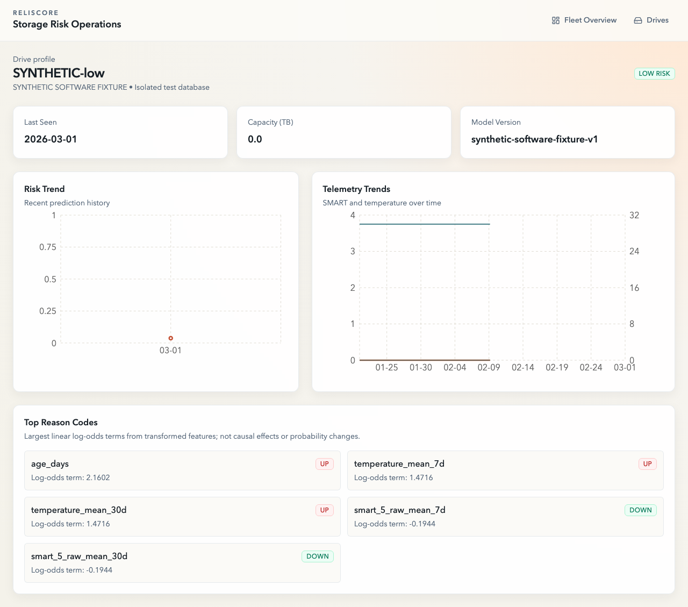

# ReliScore

**A drive's telemetry is evidence to investigate—not a promise that it will fail.** ReliScore connects historical storage measurements, careful failure labeling, a reproducible learning pipeline and a fleet triage interface.

## The engineering question

Can a predictive-maintenance system preserve the meaning of a score from raw SMART readings through training, inference and a dashboard?

That question motivated the most useful work here: keeping online and offline feature windows consistent, excluding unknown future labels, separating temporal evaluation from training, and making unavailable models visible. A dashboard that turns every quiet fleet into an urgent red queue would look busy while destroying the evidence. ReliScore therefore stores the actual model output, even when every drive scores LOW.

## What the system does

- Builds drive histories from Backblaze/public or user-provided telemetry parquet.
- Constructs 30-day failure targets with censoring and failure-day exclusion; rolling features use the last 7/30 observations.
- Fits an incremental class-balanced logistic model with a chronological holdout and a 30-day purge.
- Exports feature order, training fills, evaluation scope, baseline metrics and manifest provenance.
- Validates finite input, limits each scoring request to 1,000 drives, checks returned drive/day/version, and stores predictions transactionally.
- Shows fleet flags, individual telemetry and transformed-feature log-odds explanations. Missing artifacts produce explicit unavailable state and HTTP 503, never synthetic production scores.

This remains a computer-science project: data contracts, numerical consistency, temporal reasoning, database boundaries, service orchestration and testable ML matter more than adding unrelated finance features.

## Reading a result

A high model score means the fitted classifier prioritizes that observation under its learned objective. Class-balanced training can distort probability calibration, so a score of 0.8 is **not established evidence of an 80% fleet failure probability**. Similarly, ten HIGH flags are not a prediction of ten failures. Maintenance thresholds need cohort validation, false-positive costs and calibration at the deployment prevalence.

No full Backblaze evaluation or production performance is claimed in this delivery. Automated tests fit explicitly synthetic data to exercise the real pipeline. The [current drive screenshot](docs/media/current/synthetic-drive.png) uses the real application and an explicitly synthetic fitted software fixture. Historical screenshots and AWS material in [docs/media](docs/media) are retained as prior project history, not current deployment proof.



## Architecture and rigor

Next.js → NestJS/Prisma/PostgreSQL → FastAPI/scikit-learn. DuckDB handles historical parquet features; versioned artifacts connect training and serving.

[Methodology](docs/METHODOLOGY.md) · [Architecture](docs/ARCHITECTURE.md) · [Model card](docs/MODEL_CARD.md) · [Limitations](docs/LIMITATIONS.md) · [Delivery evidence](docs/PORTFOLIO_DELIVERY.md)

## Run locally

Use Node 22+, the pinned pnpm 9.12.3 and Python 3.12. Copy the relevant `.env.example` files and keep populated environment files untracked.

```sh
npx pnpm@9.12.3 install --frozen-lockfile
npx pnpm@9.12.3 --filter @reliscore/shared build
npx pnpm@9.12.3 --filter @reliscore/api prisma:generate
python3.12 -m venv .venv
.venv/bin/pip install -r requirements-lock.txt
```

Docker Compose starts PostgreSQL (5432), the model (8000), the API (4000) and web (3000): `docker compose up --build`. No trained model or populated database is bundled. Install trusted artifacts under `services/model/artifacts/<version>/` and restart the model to enable scoring. The database starts empty; optional `pnpm prisma:seed` in services/api generates **synthetic telemetry**, not performance evidence. Do not mix that seed with a real fleet database.

To run services directly, apply the schema with `pnpm --filter @reliscore/api exec prisma db push`, run `.venv/bin/uvicorn app.main:app --app-dir services/model`, `pnpm --filter @reliscore/api dev`, and `pnpm --filter @reliscore/web dev`. API/model URLs are configured in the environment examples. These are internal research services; an authenticated deployment perimeter is not implemented.

## Verify

```sh
npx pnpm@9.12.3 lint
npx pnpm@9.12.3 typecheck
npx pnpm@9.12.3 test
npx pnpm@9.12.3 build
.venv/bin/pytest services/model/tests -q
npx pnpm@9.12.3 audit
```

The Python suite includes a real synthetic parquet-to-fitted-model experiment, censoring and purge checks, exact schema validation, null-fill behavior, explanations and missing-artifact responses. Node tests cover feature parity, score preservation, batch provenance and API behavior. Full latest-commit CI installs locked dependencies, runs checks and builds. See the delivery report for observed counts and CI evidence.

## Further research

Does a calibrated model outperform a maintenance baseline at an acceptable false-alarm rate? Does performance survive a hardware-model holdout? How do missing SMART attributes and changing drive cohorts affect calibration? These are the next useful questions; this release supplies the engineering foundation to investigate them honestly.
