# ReliScore - Storage Risk Operations
ReliScore is a predictive failure-risk platform for storage fleets. It ingests drive telemetry, generates model-ready features, runs a 30-day failure risk model, stores scored predictions, and serves an operations dashboard for fleet-level monitoring and per-drive triage.

## Key Features
- Fleet overview with KPIs, risk distribution, and highest-risk drives.
- Drive inventory with risk bucket filters for fast triage.
- Per-drive detail view with telemetry trends, risk history, and top reason codes.
- On-demand scoring trigger through an API endpoint.
- Production-style deployment on AWS (API + model services, load balancing, logging, and database).

## Architecture
- `Next.js Dashboard (Vercel)` -> `Node.js API (/api/v1 on ECS Fargate behind ALB)` -> `FastAPI Model Service (ECS Fargate, internal routing via Cloud Map)` -> `PostgreSQL (Amazon RDS)`
- `API` handles fleet/drives read paths plus scoring orchestration.
- `Model service` returns risk scores used to update fleet and drive-level views.

The UI and API are publicly reachable through Vercel and ALB, while internal API-to-model communication is service-discovered through Cloud Map.

## Live Endpoints
- UI: `<VERCEL_URL>`
- API Base: `http://<ALB_DNS>/api/v1`
- Health: `http://<ALB_DNS>/api/v1/health`

## API Examples
- Fleet summary:
  ```bash
  curl -s "http://<ALB_DNS>/api/v1/fleet/summary" | jq
  ```
- Trigger scoring:
  ```bash
  curl -s -X POST "http://<ALB_DNS>/api/v1/score/run" | jq
  ```
- Drives list:
  ```bash
  curl -s "http://<ALB_DNS>/api/v1/drives" | jq
  ```
- Drive details:
  ```bash
  curl -s "http://<ALB_DNS>/api/v1/drives/DRV-0001" | jq
  ```

## Screenshots

### Product UI
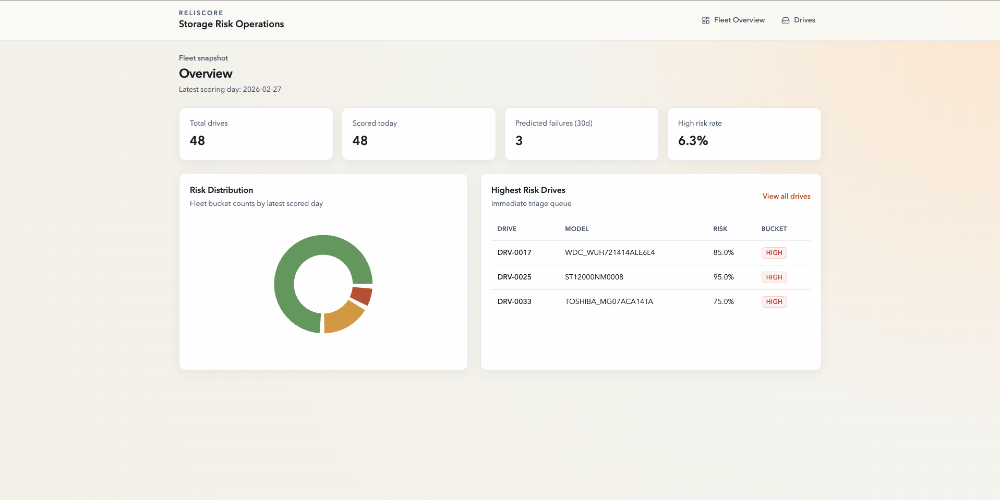
*Caption: Fleet snapshot with KPIs, risk distribution, and highest-risk drive queue.*

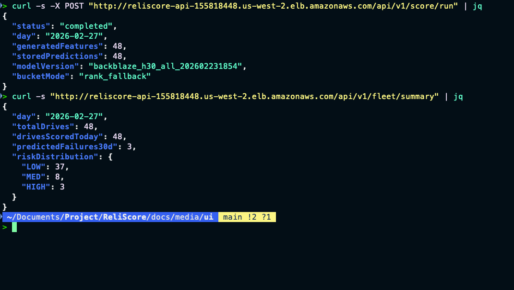
*Caption: Drives list with model version, datacenter, and risk bucket visibility across the fleet.*

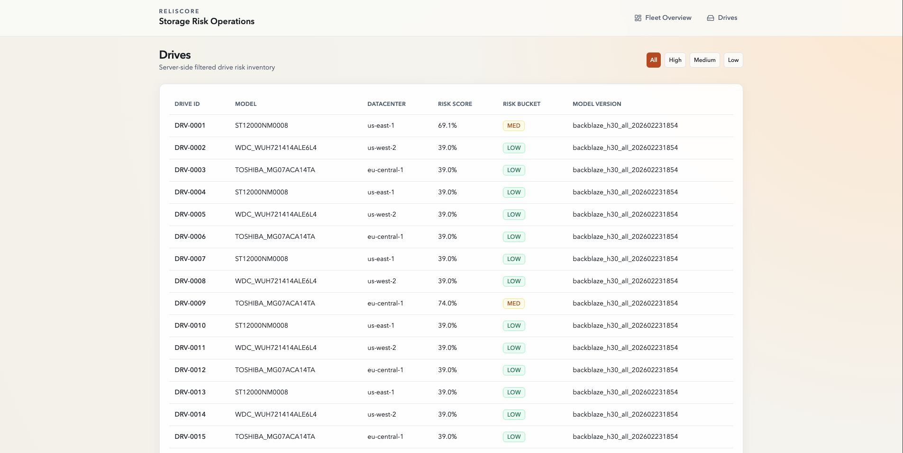
*Caption: High-risk filter view for focused incident triage.*

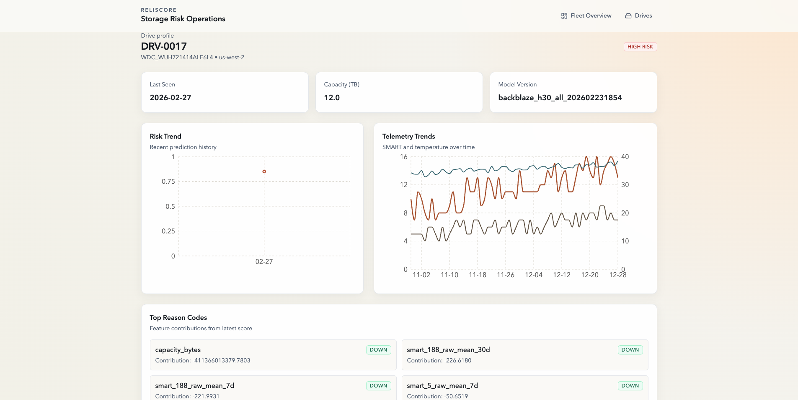
*Caption: Per-drive page with telemetry trends, recent risk signal, and explainability reason codes.*

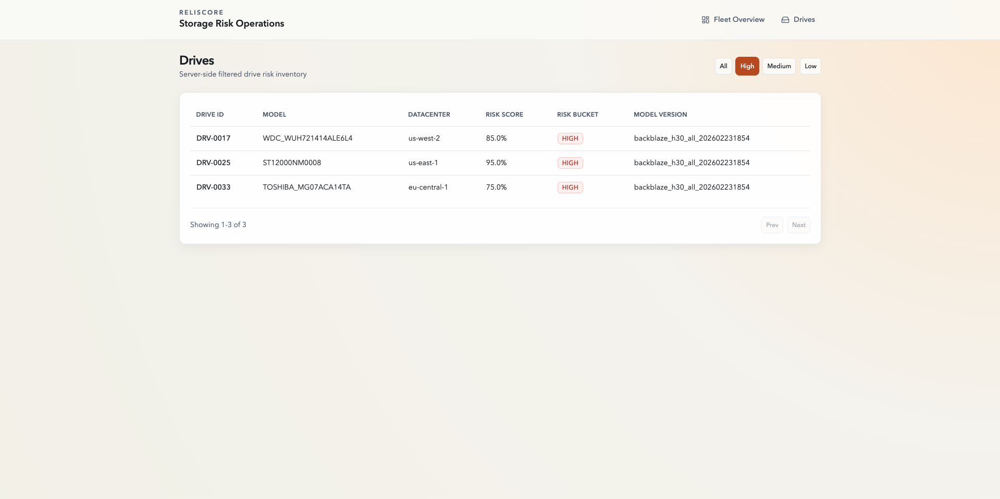
*Caption: Terminal validation of scoring trigger and fleet summary responses from the live API.*

### AWS Backend
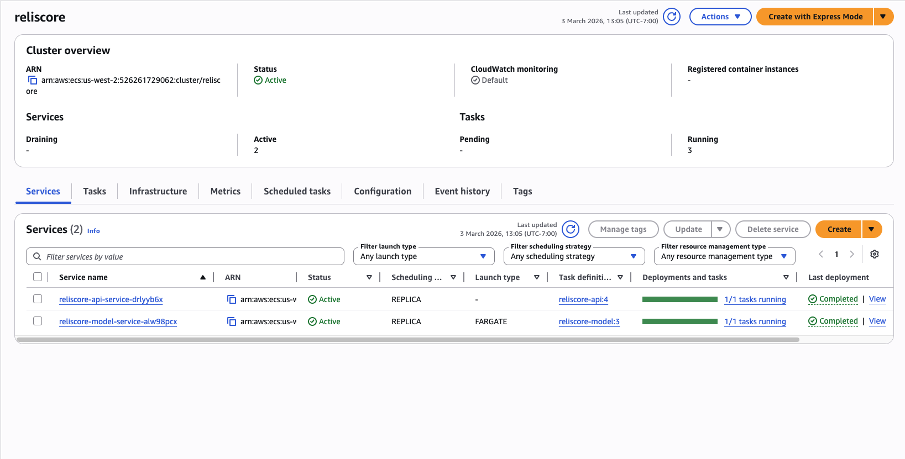
*Caption: ECS cluster showing both API and model services running on Fargate.*

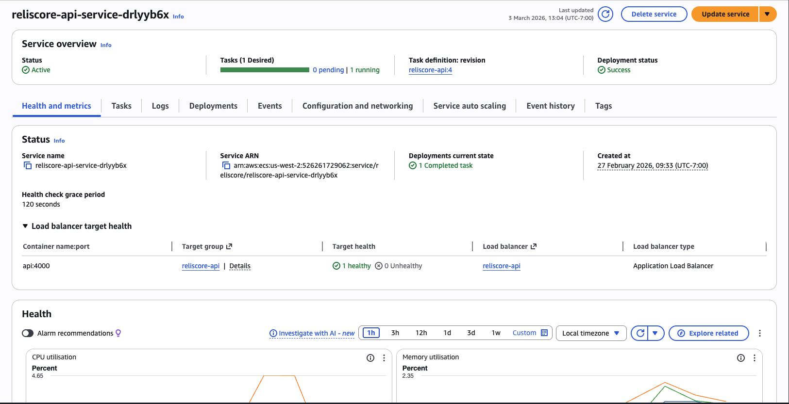
*Caption: API service deployment status and load balancer target health.*

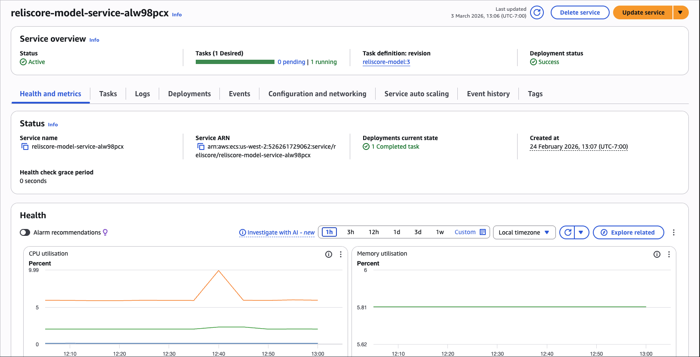
*Caption: Model service deployment status and runtime metrics.*

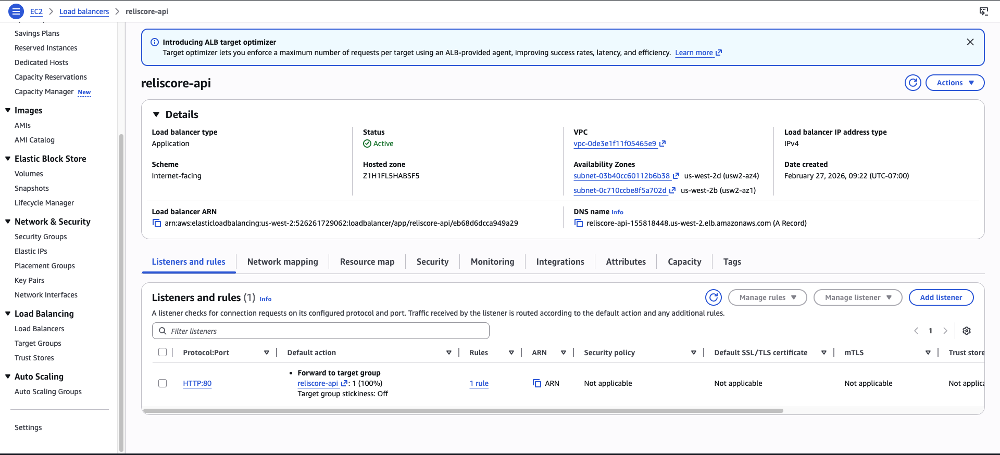
*Caption: ALB configuration and DNS endpoint used by external API traffic.*

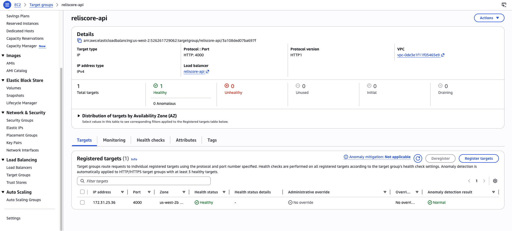
*Caption: API target group with healthy registered targets.*

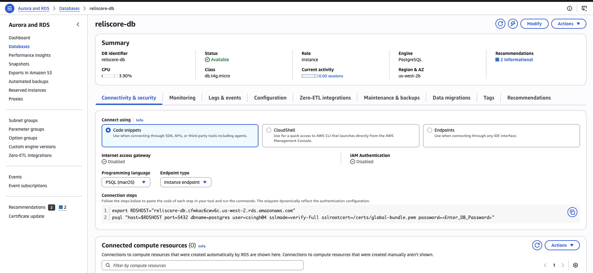
*Caption: PostgreSQL instance summary used for persistence of predictions and metadata.*

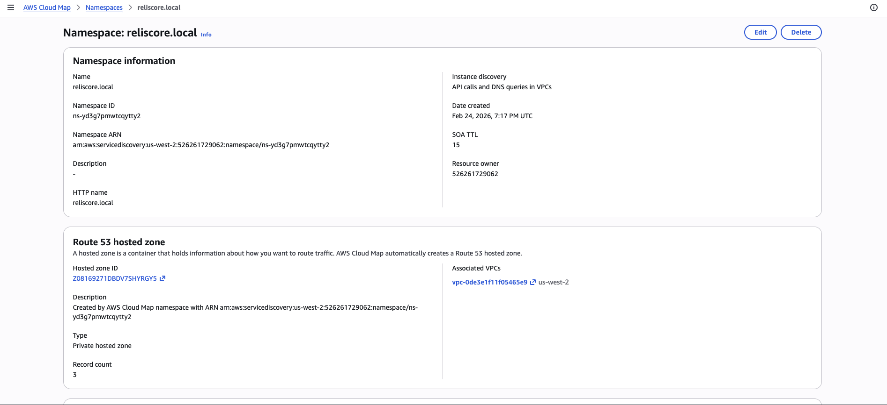
*Caption: Cloud Map namespace used for internal service discovery.*

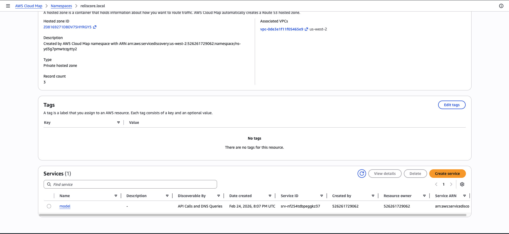
*Caption: Service registration details for internal model routing.*

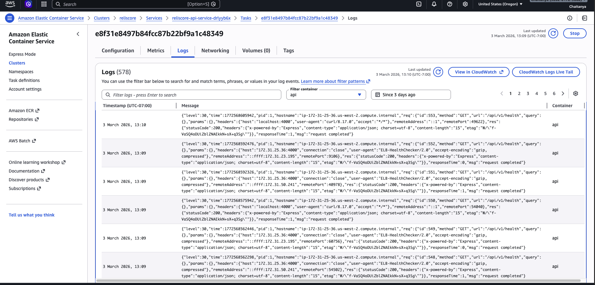
*Caption: API task logs and health-check traffic visibility via ECS/CloudWatch integration.*

## How to Run Locally
### Prerequisites
- Node.js (LTS)
- `pnpm`
- Python 3.10+
- Docker
- PostgreSQL

### High-Level Workflow
```bash
# Frontend (Next.js)
cd <frontend-dir>
pnpm install
pnpm dev

# Backend API (Node.js)
cd <api-dir>
pnpm install
pnpm dev

# Model service (FastAPI)
cd <model-dir>
python -m venv .venv
source .venv/bin/activate
pip install -r requirements.txt
uvicorn app.main:app --reload --port 8000

# Database (example)
docker compose up -d postgres
```

Set environment variables for service URLs, database connection, and runtime settings before starting the stack.

## Deployment Notes
- Frontend is deployed on Vercel.
- API runs on AWS ECS Fargate behind an Application Load Balancer.
- Model service runs on ECS and is resolved internally via Cloud Map.
- PostgreSQL is hosted on Amazon RDS.
- Container images are published to ECR, and runtime logs/metrics are available in CloudWatch.

## Tech Stack
| Layer | Technology | Role |
|---|---|---|
| Frontend | Next.js | Fleet and drive operations dashboard |
| API | Node.js (Nest/Express style) | `/api/v1/*` endpoints, orchestration, read/write paths |
| Model Service | FastAPI (Python) | Health + scoring endpoints |
| Database | PostgreSQL (RDS) | Predictions, drive metadata, and scoring outputs |
| Compute | AWS ECS Fargate | Container runtime for API and model services |
| Networking | ALB + Cloud Map | External routing + internal service discovery |
| Registry/Observability | ECR + CloudWatch | Image storage, logs, and service visibility |
| Frontend Hosting | Vercel | Public dashboard delivery |

## Security & Cost
- Do not commit secrets to source control; use environment variables and secret management for credentials.
- Limit exposure of services to required paths and ports only, and monitor logs for unusual traffic.
- Tear down cloud resources after demos or testing to avoid unnecessary AWS charges.
